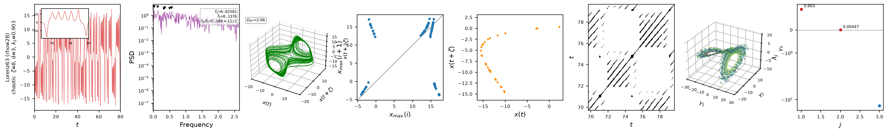

# Analysing a model

`dynamodels` only integrates equations and tracks history; characterizing the
resulting signal — is it periodic, quasiperiodic, or chaotic? what is its
leading Lyapunov exponent? — is the job of the sibling package
[`ntsa`](https://andreanovoa.github.io/ntsa/), which works on any model that
follows the `dynamodels` protocol (`time_integrate`, `hist`, `t_CR`,
`t_transient`): every model on this site qualifies without modification.

```bash
pip install ntsa
```

```python
from dynamodels.physical import Lorenz63
from ntsa.characterize import characterize

characterize(Lorenz63(), labels='Lorenz63 (rho=28)', pdf_name='lorenz63_characterization.pdf')
```

`characterize` respawns the model, runs it, and produces one diagnostic row
per case:



*Nonlinear time-series diagnostics for Lorenz63 at $\rho=28$, left to right:
the observable time series, with a zoomed inset; its power spectral density;
the 3-D delay-embedded portrait, annotated with the Kaplan-Yorke dimension
$D_{KY}$; the first-return map of the maxima; a plane-crossing Poincare
section; a recurrence plot; a 3-D classical-MDS embedding of the full state,
coloured by time; and the Lyapunov spectrum, with $\lambda_1 \approx 0.903$
confirming the classification as chaotic.*

`ntsa` also exposes `classify_regime`, `bifurcation_sweep` and
`lyapunov_spectrum` directly, and its `DataSeries` class runs the same
diagnostics on a signal that was never produced by a `dynamodels` model — a
recorded experiment, for instance. See the
[`ntsa` documentation](https://andreanovoa.github.io/ntsa/) for the full API
and theory notes on delay embeddings, regime classification, and Lyapunov
spectra.
