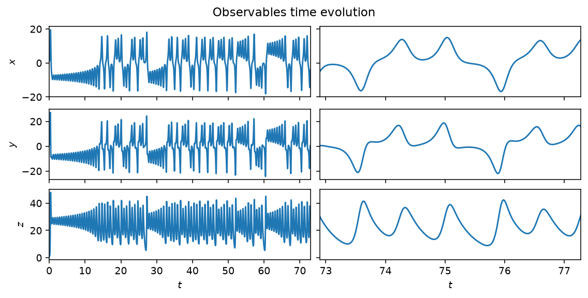

# dynamodels

A `Model` couples a governing equation to a pre-allocated state history and a
pluggable time integrator. Every physical model in the package — three
low-order oscillators, two spatially extended PDEs, and the Lorenz systems —
implements the same interface: `time_integrate(Nt)` advances the state,
`get_observable_hist()` returns what a sensor would measure, and
`visualize_history()` plots both. The package itself depends only on numpy,
scipy, matplotlib and typeguard: no machine-learning stack.

*The Lorenz63 system integrated past its transient at the classical parameters
($\rho=28$, $\sigma=10$, $\beta=8/3$): the three state components, full history
(left) and the last four Lyapunov times (right). See [Lorenz63](models/lorenz63.md).*

## Where to go

- [Getting started](getting-started.md) — install, the five-line quickstart, the `Model` interface.
- Models — one page per physical model, each with the governing equations and a figure
  of its time evolution: [Lorenz63](models/lorenz63.md), [Lorenz96](models/lorenz96.md),
  [Van der Pol](models/van_der_pol.md), [Rijke tube](models/rijke.md),
  [Annular combustor](models/annular.md), [Kuramoto-Sivashinsky (1-D)](models/ks.md),
  [Kuramoto-Sivashinsky (2-D)](models/ks2d.md), [Kuznetsov oscillator](models/kuznetsov.md).
- [Analysing a model](analysis.md) — nonlinear time-series diagnostics with
  [`ntsa`](https://andreanovoa.github.io/ntsa/), the sibling package built on this one.
- API reference — [`Model`](api/model.md), [`Integrator`](api/integrator.md),
  [`HistoryTracker`](api/history.md), [`utils`](api/utils.md).

## Ecosystem

- [`ntsa`](https://andreanovoa.github.io/ntsa/) — nonlinear time-series analysis
  (Lyapunov exponents, delay embeddings, regime classification, bifurcation sweeps)
  for any model that follows the `dynamodels` protocol.
- [romda](https://andreanovoa.github.io/real-time-bias-aware-DA/) — bias-aware
  ensemble data assimilation built on top of both.

## Citing

If a model in this package is central to your work, please cite its original
reference, listed on that model's page. To cite the package itself:

