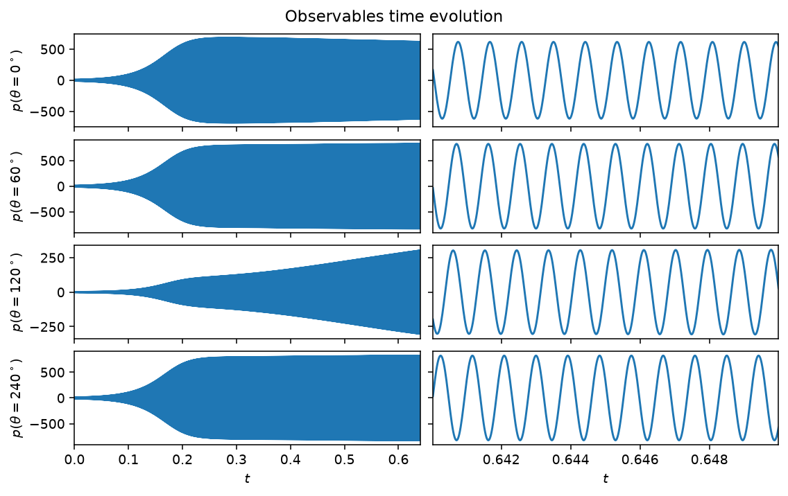

# Annular combustor

The annular combustor model extends the single-mode picture of the
[Van der Pol](van_der_pol.md) and [Rijke](rijke.md) models to the first
azimuthal mode pair of an annular geometry, such as a gas-turbine combustion
chamber. Decomposing the acoustic pressure as
$p(\theta,t) = \eta_a(t)\cos(\theta) + \eta_b(t)\sin(\theta)$ gives four
coupled first-order ODEs for $(\eta_a, \dot{\eta}_a, \eta_b, \dot{\eta}_b)$,
with a growth rate $\nu$, a resistive asymmetry $c_2\beta$, a saturation
$\kappa$, and a reactive asymmetry $(\epsilon, \Theta_\epsilon)$ that breaks
the rotational symmetry of an idealized annulus. The balance between $\nu$
and $c_2\beta$ sets the qualitative regime: a purely spinning mode
($\nu, c_2\beta = 30, 5$), a purely standing mode ($0, 50$), or a mixed mode
($20, 18$) that precesses. The full equations are in the
[API reference](#api) below.



*Pressure at the four default microphones, at the mixed-mode parameters
$(\nu, c_2\beta) = (20, 18)$, past the transient. Left: the full run. Right:
a few periods of the established oscillation. The $\theta=120^\circ$
microphone sits closer to a pressure node of this mode and saturates more
slowly.*

## Quickstart

```python
from dynamodels.physical import Annular

model = Annular(nu=20., c2beta=18., dt=1./51200)
psi, t = model.time_integrate(Nt=30000)
model.update_history(psi, t)
model.visualize_observable_hist()
model.close()
```

The class defaults (`ER=0.5`) give $\nu<0$, a linearly stable mode that
decays to the origin rather than self-oscillating; `Annular.nu_from_ER(ER)`
and `Annular.c2beta_from_ER(ER)` map an equivalence ratio to $(\nu,
c_2\beta)$ along the calibrated experimental trend, and the docstring below
lists three illustrative regimes (spinning, standing, mixed).

## Reference

Novoa, A., Noiray, N., Dawson, J. R., & Magri, L. (2024). A real-time
digital twin of azimuthal thermoacoustic instabilities. *Journal of Fluid
Mechanics*, 1001, A49.
[doi:10.1017/jfm.2024.1052](https://doi.org/10.1017/jfm.2024.1052)

## API

::: dynamodels.physical.annular.Annular
