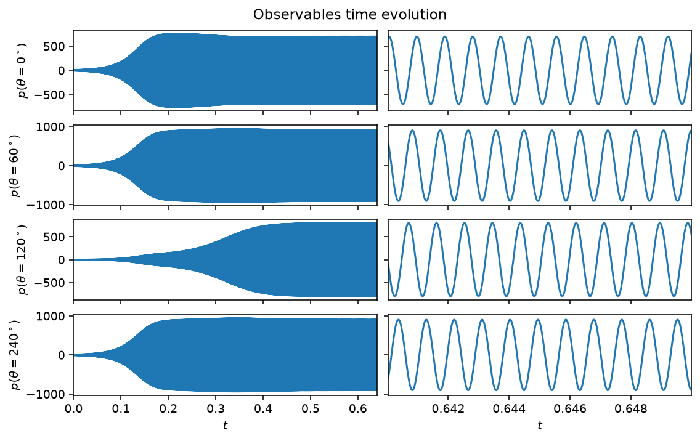
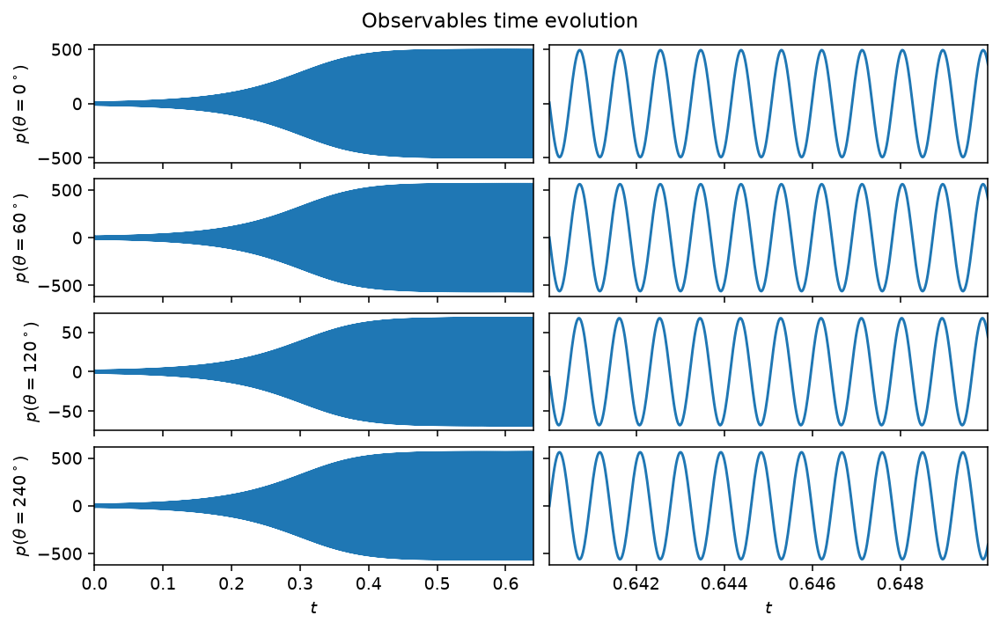
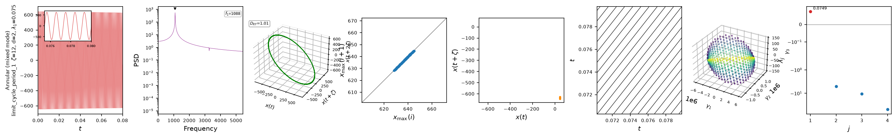

# Annular combustor

The annular combustor model extends the single-mode picture of the
[Van der Pol](van_der_pol.md) and [Rijke](rijke.md) models to the first
azimuthal mode pair of an annular geometry, such as a gas-turbine combustion
chamber. Decomposing the acoustic pressure as
$p(\theta,t) = \eta_a(t)\cos(\theta) + \eta_b(t)\sin(\theta)$ gives four
coupled first-order ODEs for $(\eta_a, \dot{\eta}_a, \eta_b, \dot{\eta}_b)$,
with a growth rate $\nu$, a resistive asymmetry $c_2\beta$, a saturation
$\kappa$, and a reactive asymmetry $(\epsilon, \Theta_\epsilon)$ that breaks
the rotational symmetry of an idealized annulus. The full equations are in
the [API reference](#api) below.

The balance between $\nu$ and $c_2\beta$ sets the qualitative regime. Three
named cases are pre-tabulated in `CASES` and selected with `case='...'`
(explicit keyword arguments override a case's values); the class defaults
(`ER=0.5`) give $\nu<0$, a linearly stable mode that decays to the origin
rather than self-oscillating, so pick a case (or set `nu`/`c2beta`
explicitly) for a self-sustained oscillation.

## Quickstart

```python
from dynamodels.physical import Annular

model = Annular(case='mixed', dt=1./51200)
psi, t = model.time_integrate(Nt=30000)
model.update_history(psi, t)
model.visualize_observable_hist()
model.close()
```

`Annular.nu_from_ER(ER)` and `Annular.c2beta_from_ER(ER)` map an equivalence
ratio to $(\nu, c_2\beta)$ along the calibrated experimental trend, in case
neither a case nor explicit values fit.

## Regimes



*`case='spinning'`, $(\nu, c_2\beta) = (30, 5)$: growing onto a self-sustained
oscillation. With $c_2\beta$ small relative to $\nu$, the pattern rotates
around the annulus rather than sitting still, so the four microphones' final
amplitudes are closer to each other than in the standing case below (the
small residual spread comes from the model's built-in reactive asymmetry,
$\epsilon$).*



*`case='standing'`, $(\nu, c_2\beta) = (0, 50)$: a fixed node-antinode
pattern rather than a rotating one. The $\theta=120^\circ$ microphone sits
almost exactly on a node, with roughly an order of magnitude smaller
amplitude than the other three.*


*`case='mixed'`, $(\nu, c_2\beta) = (20, 18)$, past the transient. Left: the
full run. Right: a few periods of the established oscillation. The
$\theta=120^\circ$ microphone sits closer to a pressure node of this mode
and saturates more slowly.*

## Nonlinear diagnostics



*Diagnostics from [`ntsa.characterize`](../analysis.md) on the mixed mode,
left to right: the observable time series with a zoomed inset; power
spectral density; the 3-D delay-embedded portrait; the first-return map of
the maxima; a plane-crossing Poincare section; a recurrence plot; a 3-D
classical-MDS embedding of the full state; and the leading Lyapunov exponent.*

## Reference

Novoa, A., Noiray, N., Dawson, J. R., & Magri, L. (2024). A real-time
digital twin of azimuthal thermoacoustic instabilities. *Journal of Fluid
Mechanics*, 1001, A49.
[doi:10.1017/jfm.2024.1052](https://doi.org/10.1017/jfm.2024.1052)

## API

::: dynamodels.physical.annular.Annular
