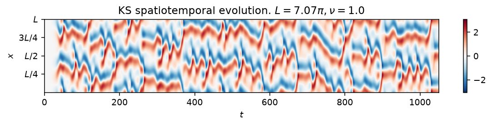
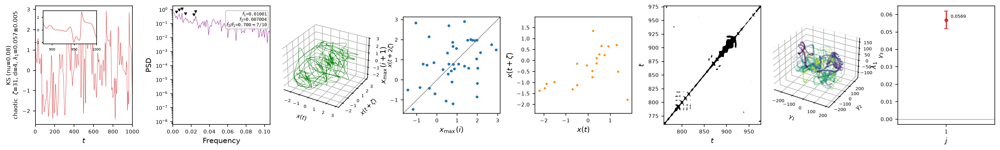

# Kuramoto-Sivashinsky (1-D)

The Kuramoto-Sivashinsky equation is a one-dimensional partial differential
equation that is chaotic even in the simplest, most weakly nonlinear regime,
which makes it a standard testbed for reduced-order modelling and data
assimilation of spatiotemporal chaos,

$$
u_t + u_{xx} + \nu\, u_{xxxx} + u\, u_x = 0, \qquad x \in (0, L],
$$

with periodic boundary conditions. The second-order term is destabilizing,
the fourth-order term is a stabilizing hyperviscosity, and the nonlinear
term transfers energy between scales; together they produce a cascade that
saturates into sustained spatiotemporal chaos. The state, `psi0`, is the
field in Fourier space, and the equation is solved with the fourth-order
exponential time-differencing scheme (ETDRK4) of Kassam & Trefethen.



*Space-time diagram of $u(x,t)$ at $\nu=0.08$ (equivalently $L=2\pi/\sqrt{\nu}$
at $\nu=1$), past the transient: colour encodes the field, red and blue the
positive and negative extremes. The cellular pattern that drifts and merges
across the domain is the model's chaotic attractor.*

## Quickstart

```python
from dynamodels.physical import KS

model = KS(Nx=256, nu=0.08, dt=0.25)
psi, t = model.time_integrate(Nt=4000)
model.update_history(psi, t)
model.visualize_spatiotemporal_hist()
model.close()
```

`nu` and `L` are independent: give `nu` alone for the standard
nondimensionalization ($L=2\pi/\sqrt{\nu}$, integrated at $\nu=1$), `L` alone
for $\nu=1$ on that domain, or both for the general two-parameter form. See
the class docstring below for the exact resolution rule and the rescaling
that relates the two.

## Nonlinear diagnostics



*Diagnostics from [`ntsa.characterize`](../analysis.md) on a single grid
point, left to right: the observable time series with a zoomed inset; power
spectral density; the 3-D delay-embedded portrait; the first-return map of
the maxima; a plane-crossing Poincare section; a recurrence plot; a 3-D
classical-MDS embedding of the full spectral state; and the leading Lyapunov
exponent, estimated Jacobian-free from perturbation growth since `KS` steps
with `time_step` rather than `time_derivative`.*

## Reference

Kuramoto, Y., & Tsuzuki, T. (1976). Persistent propagation of concentration
waves in dissipative media far from thermal equilibrium. *Progress of
Theoretical Physics*, 55(2), 356-369.

Kassam, A.-K., & Trefethen, L. N. (2005). Fourth-order time-stepping for
stiff PDEs. *SIAM Journal on Scientific Computing*, 26(4), 1214-1233.

## API

::: dynamodels.physical.kuramoto_sivashinsky.KS
