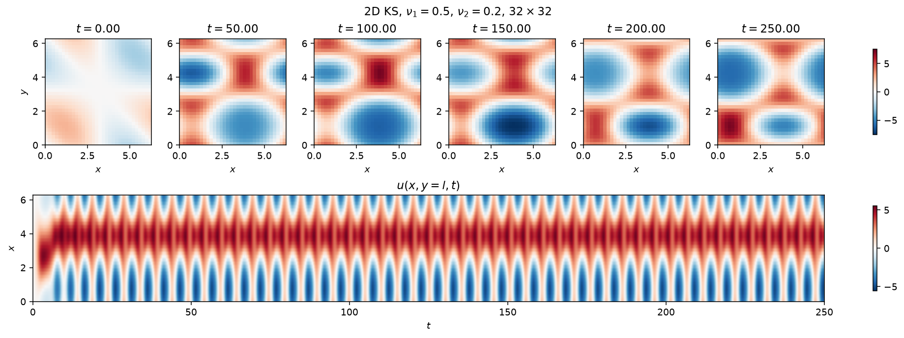
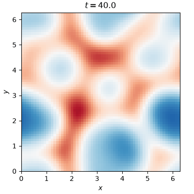
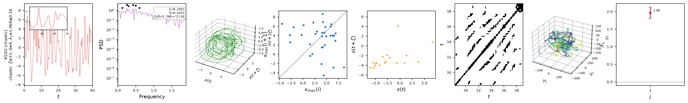

# Kuramoto-Sivashinsky (2-D)

The two-dimensional, anisotropic extension of the [1-D Kuramoto-Sivashinsky
equation](ks.md) adds a second spatial direction with its own hyperviscosity
$\nu_2$,

$$
u_t + \left(u_{xx} + \alpha\, u_{yy}\right)
    + \nu_1 \left(\partial_x^2 + \alpha\, \partial_y^2\right)^2 u
    + \tfrac{1}{2}\left(u_x^2 + \alpha\, u_y^2\right) = 0,
\qquad (x, y) \in (0, 2\ell]^2,
$$

doubly periodic, with anisotropy ratio $\alpha=\nu_2/\nu_1$. The state is the
physical field itself (not its Fourier transform, as in the 1-D case),
flattened to shape `(Nx * Ny, m)`. Which regime the equation settles into —
periodic, travelling, quasiperiodic, or chaotic — depends on $(\nu_1, \nu_2)$;
five named regimes are pre-tabulated in `CASES` and selected with
`case='...'`. The class defaults are the periodic regime.



*Top: six snapshots of the field $u(x,y,t)$ at $\nu_1=0.5$, $\nu_2=0.2$ (the
periodic regime), evenly spaced past the transient. Bottom: space-time
diagram of the mid-domain slice $u(x, y=\ell, t)$, showing the pattern
travel across the domain and repeat.*

A single snapshot, or a 1-D slice's space-time diagram, cannot show how the
whole 2-D field evolves. For the `chaotic` regime, an animation does:



*`case='chaotic'` ($\nu_1=\nu_2=0.1$, $64\times64$): the field $u(x,y,t)$
past the transient, sampled every few output steps. Structures merge, split
and drift with no repeating pattern -- the two-dimensional analogue of the
cellular chaos on the [1-D KS](ks.md) page.*

## Quickstart

```python
from dynamodels.physical import KS2D

model = KS2D()   # class defaults are the periodic regime; try case='chaotic' too
psi, t = model.time_integrate(Nt=4000)
model.update_history(psi, t)
model.visualize_spatiotemporal_hist()
model.close()
```

| Regime | $\nu_1$ | $\nu_2$ | Grid | $\mathrm{d}t$ |
| --- | --- | --- | --- | --- |
| `periodic` (default) | 0.5 | 0.2 | 32x32 | 0.01 |
| `travelling` | 0.5 | 0.35 | 32x32 | 0.1 |
| `quasi-periodic` | 0.5 | 0.1 | 32x32 | 0.01 |
| `chaotic` | 0.1 | 0.1 | 64x64 | 0.01 |
| `chaotic_B` | 0.3 | 0.1 | 64x64 | 0.01 |

Explicit keyword arguments override a case's values, e.g.
`KS2D(case='chaotic', Nx=128, Ny=128)`.

## Nonlinear diagnostics



*Diagnostics from [`ntsa.characterize`](../analysis.md) on the chaotic case,
at a single grid point, left to right: the observable time series with a
zoomed inset; power spectral density; the 3-D delay-embedded portrait; the
first-return map of the maxima; a plane-crossing Poincare section; a
recurrence plot; a 3-D classical-MDS embedding of the full 2-D field; and
the leading Lyapunov exponent, estimated Jacobian-free from perturbation
growth since `KS2D` steps with `time_step` rather than `time_derivative`.*

## Reference

Kuramoto, Y., & Tsuzuki, T. (1976). Persistent propagation of concentration
waves in dissipative media far from thermal equilibrium. *Progress of
Theoretical Physics*, 55(2), 356-369.

## API

::: dynamodels.physical.kuramoto_sivashinsky_2d.KS2D
