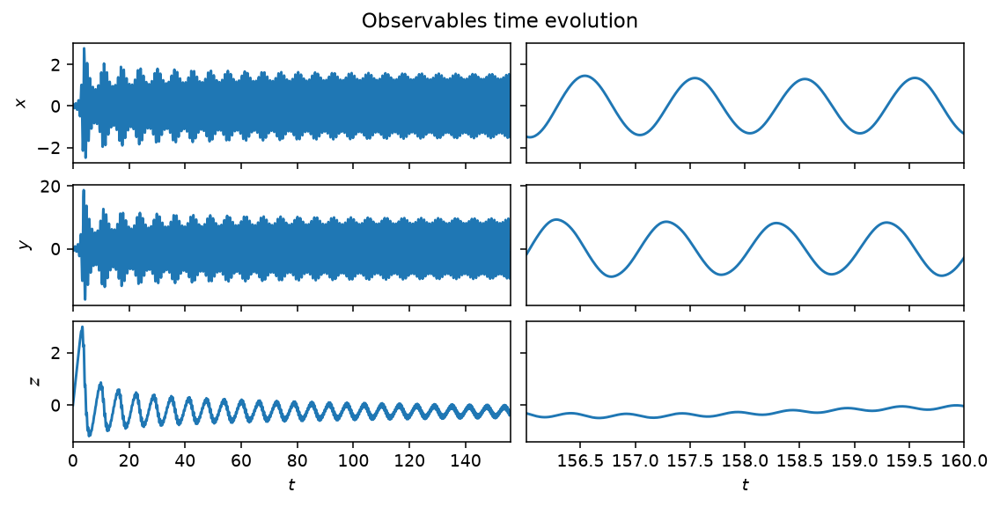
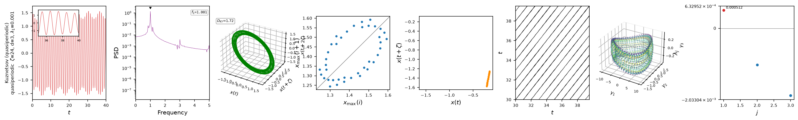

# Kuznetsov oscillator

The Kuznetsov oscillator is a simple autonomous generator of quasiperiodic
motion: a three-dimensional system that produces periodic, quasiperiodic and
chaotic behaviour depending on $(\lambda, \omega_0, \mu)$,

$$
\dot{x} = y, \qquad
\dot{y} = y \left( \lambda + z + x^2 - \tfrac{1}{2} x^4 \right) - \omega_0^2 x, \qquad
\dot{z} = \mu - x^2.
$$

Unlike the [Lorenz63](lorenz63.md) system, which is chaotic at its classical
parameters, the Kuznetsov oscillator's class defaults ($\lambda=0$,
$\omega_0=2\pi$, $\mu=1$) sit on a two-frequency quasiperiodic torus, which
makes it a useful counter-example when testing whether a chaos-classification
method (positive Lyapunov exponent, broadband spectrum) correctly abstains on
a non-chaotic attractor.



*Time evolution of $x$, $y$ and $z$ at the class defaults, past the initial
transient. Left: the full run, settling onto the quasiperiodic torus. Right:
the last four characteristic times, showing the faster of the two
incommensurate frequencies.*

## Quickstart

```python
from dynamodels.physical import Kuznetsov

model = Kuznetsov(lam=0., omega0=2 * 3.14159, mu=1., dt=0.01)
psi, t = model.time_integrate(Nt=16000)
model.update_history(psi, t)
model.visualize_observable_hist()
model.close()
```

## Nonlinear diagnostics



*Diagnostics from [`ntsa.characterize`](../analysis.md), left to right: the
observable time series with a zoomed inset; power spectral density, with two
incommensurate peaks; the 3-D delay-embedded portrait, a torus rather than a
fractal attractor; the first-return map and Poincare section, closed curves
rather than point clouds; a recurrence plot; a 3-D classical-MDS embedding;
and a near-zero leading Lyapunov exponent — quasiperiodic, not chaotic,
despite the broadband-looking time series.*

## Reference

Kuznetsov, A. P., Kuznetsov, S. P., & Stankevich, N. V. (2010). A simple
autonomous quasiperiodic self-oscillator. *Communications in Nonlinear
Science and Numerical Simulation*, 15(6), 1676-1681.
[doi:10.1016/j.cnsns.2009.06.027](https://doi.org/10.1016/j.cnsns.2009.06.027)

## API

::: dynamodels.physical.kuznetsov.Kuznetsov
