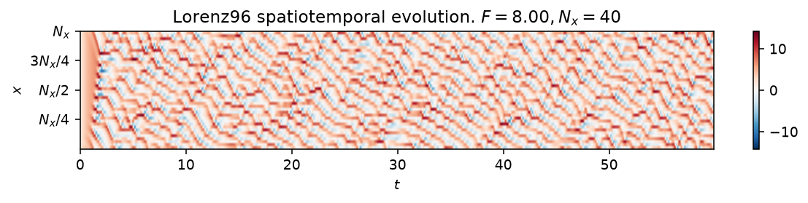

# Lorenz96

The Lorenz (1996) system extends the same idea to a lattice of $N_x$
variables, coupled quadratically to their two upstream neighbours, damped
linearly, and driven by a constant forcing $F$,

$$
\dot{x}_i = \left(x_{i+1} - x_{i-2}\right) x_{i-1} - x_i + F,
\qquad i = 0, \dots, N_x - 1,
$$

with indices taken cyclically modulo $N_x$. It was designed as a minimal
model of atmospheric predictability: the forcing $F$ injects energy at large
scales, the quadratic term transfers it downscale, and dissipation removes it,
so the same instability that limits weather forecasts appears here in a
system small enough to integrate on a laptop. The classical parameters
($N_x=40$, $F=8$) are chaotic; `Nx` is a structural parameter fixed at
construction, not one of the estimable `params`.



*Space-time diagram of the 40-variable lattice at $F=8$, past the transient:
colour encodes $x_i(t)$, with red and blue the positive and negative
extremes. The travelling, roughly periodic wave packets are the model's
analogue of synoptic-scale weather systems.*

## Quickstart

```python
from dynamodels.physical import Lorenz96

model = Lorenz96(Nx=40, F=8., dt=0.01)
psi, t = model.time_integrate(Nt=6000)
model.update_history(psi, t)
model.visualize_spatiotemporal_hist()
model.close()
```

Three components are observable by default (`observed_idx=[0, Nx//2, Nx-1]`);
pass `observed_idx` to choose others.

## Reference

Lorenz, E. N. (1996). Predictability: a problem partly solved. *Proceedings
of the Seminar on Predictability*, Vol. 1, ECMWF, Reading, UK, 1-18.

## API

::: dynamodels.physical.lorenz96.Lorenz96
