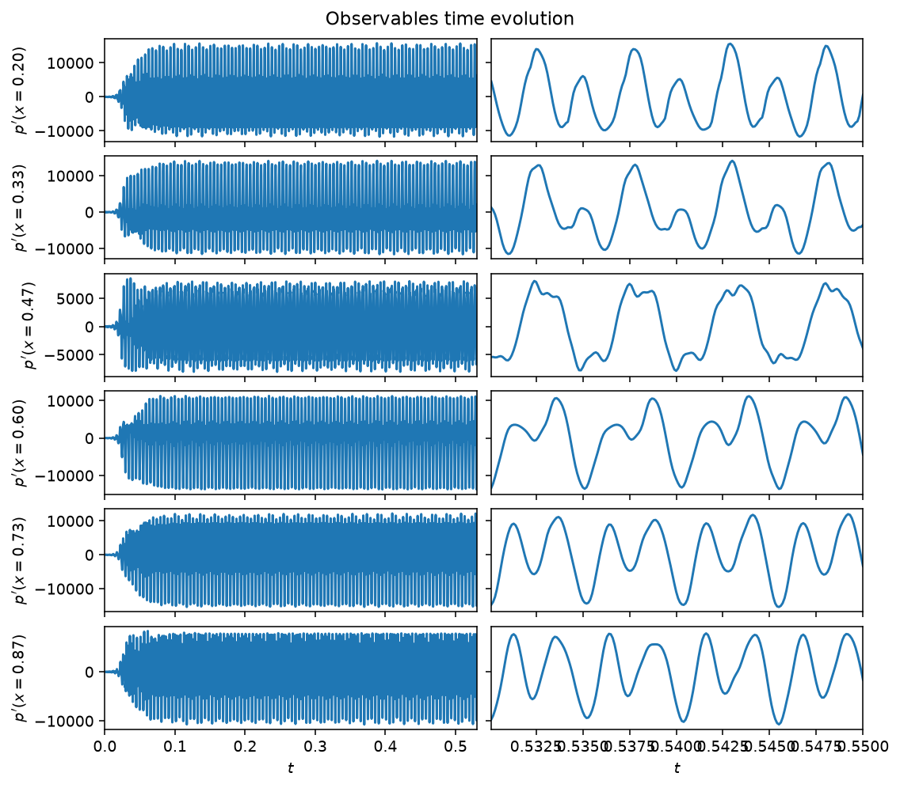
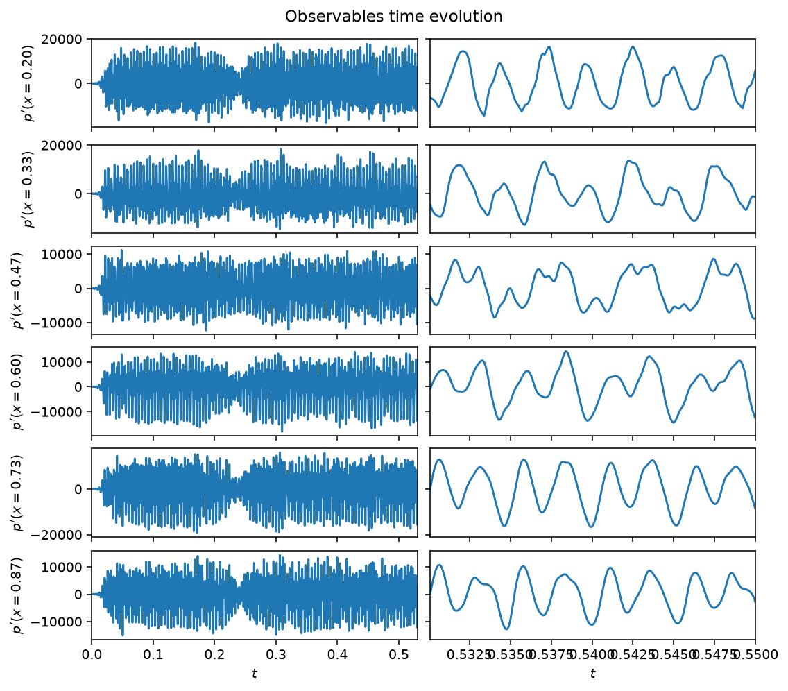
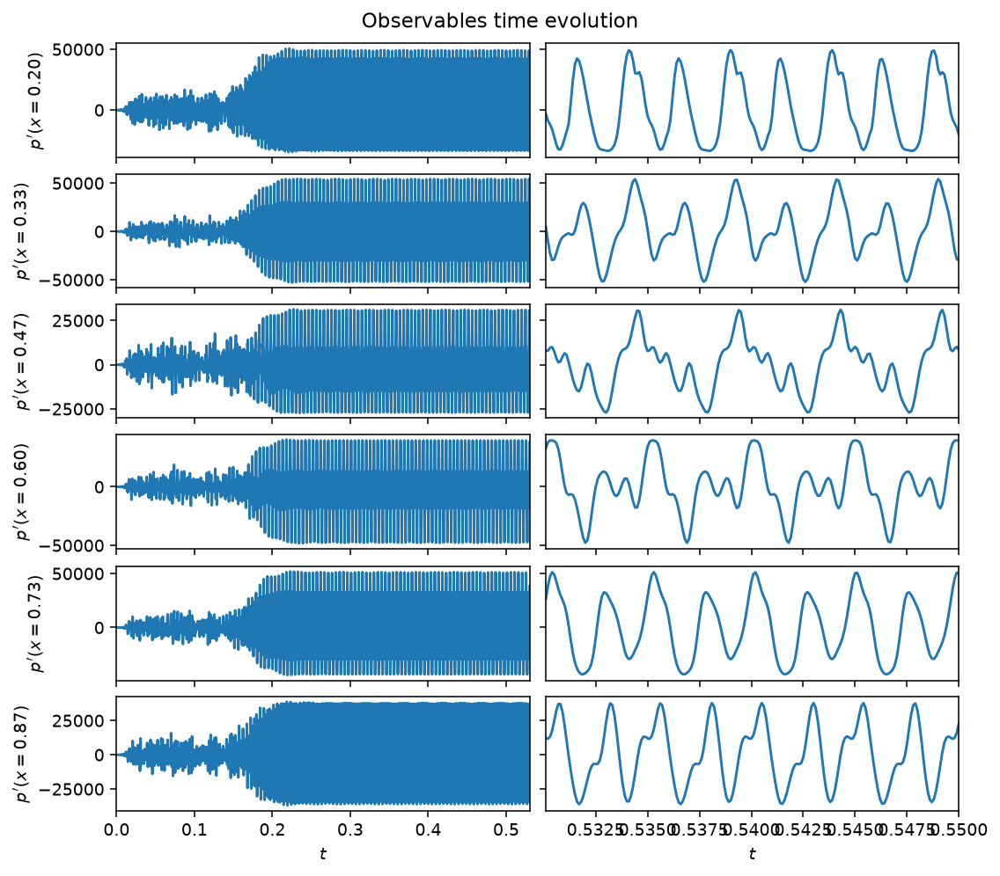
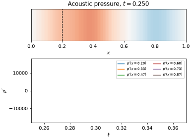
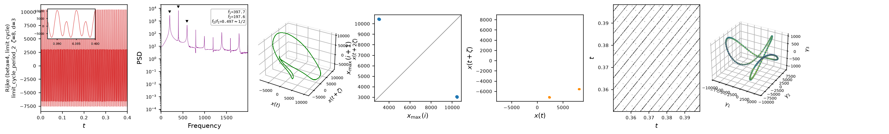

# Rijke tube

The Rijke tube is a longitudinal thermoacoustic system: a heated gauze inside
a tube couples an unsteady heat release to the acoustic field, and the two
can lock into a self-sustained oscillation. The acoustic velocity and
pressure are expanded on $N_m$ Galerkin modes, giving modal ODEs for each
mode's amplitude $\eta_j$ and its rate $\mu_j$, damped at rate
$\zeta_j = C_1 j^2 + C_2 \sqrt{j}$ and driven by the heat release projected
onto the modes. The heat release itself follows a gain-delay law: it depends
on the acoustic velocity at the flame location $x_f$, delayed by a time
$\tau$ and related through a square-root ($\text{law}='sqrt'$) or a
saturating arctangent ($\text{law}='tan'$) nonlinearity. The delay is
realized numerically by advecting the velocity along an auxiliary field
discretized with $N_c$ Chebyshev collocation points. The estimable
parameters are the heat-release intensity $\beta$, the delay $\tau$, the
damping coefficients $C_1$, $C_2$, and the saturation $\kappa$; the
observables are the pressure at `Nq` microphone locations. The full modal
equations are in the [API reference](#api) below.

$\beta$ alone routes the system through a sequence of regimes, four of which
are pre-tabulated in `CASES` and selected with `case='...'`.

## Quickstart

```python
from dynamodels.physical import Rijke

model = Rijke(case='limit_cycle', dt=1e-4)
psi, t = model.time_integrate(Nt=5000)
model.update_history(psi, t)
model.visualize_observable_hist()
model.close()
```

## Regimes


*`case='limit_cycle'` ($\beta=4$, the class default): a period-2 limit
cycle, its two harmonics visible as the alternating tall/short peaks in the
zoomed panel.*



*`case='frequency_locked'` ($\beta=8$): two modes lock onto a common
period, giving the slow amplitude-modulated (beating) waveform in the
zoomed panel.*



*`case='chaotic'` ($\beta=12$, measured $\lambda_1=161\,\mathrm{s^{-1}}$):
an aperiodic, broadband pressure signal.*



*`case='relaminarized'` ($\beta=18$): past the chaotic window, the system
relaminarizes onto a period-3 limit cycle at a larger amplitude.*

The microphone traces above are samples of a field that fills the whole tube.
For the chaotic case, an animation shows both at once:



*`case='chaotic'` ($\beta=12$), past the transient. Top: the acoustic pressure
$p'(x,t)$ along the tube, with the flame location $x_f=0.2$ dashed. Bottom: the
same field sampled at the six microphones. The pressure node imposed by the
open ends stays fixed while the amplitude varies aperiodically. The
[Rijke tube tutorial](../tutorials.md) builds this figure step by step.*

## Nonlinear diagnostics



*Diagnostics from [`ntsa.characterize`](../analysis.md) on the limit-cycle
case, left to right: the observable time series with a zoomed inset; power
spectral density; the 3-D delay-embedded portrait; the first-return map of
the maxima; a plane-crossing Poincare section; a recurrence plot; and a 3-D
classical-MDS embedding of the full modal state. The last panel (leading
Lyapunov exponent) is blank here: for a limit cycle this close to neutral,
the perturbation-growth fit's own reliability guard abstains rather than
report a noisy estimate -- see [Analysing a model](../analysis.md).*

## Reference

Novoa, A., & Magri, L. (2022). Real-time thermoacoustic data assimilation.
*Journal of Fluid Mechanics*, 948, A35.
[doi:10.1017/jfm.2022.653](https://doi.org/10.1017/jfm.2022.653)

## API

::: dynamodels.physical.rijke.Rijke
