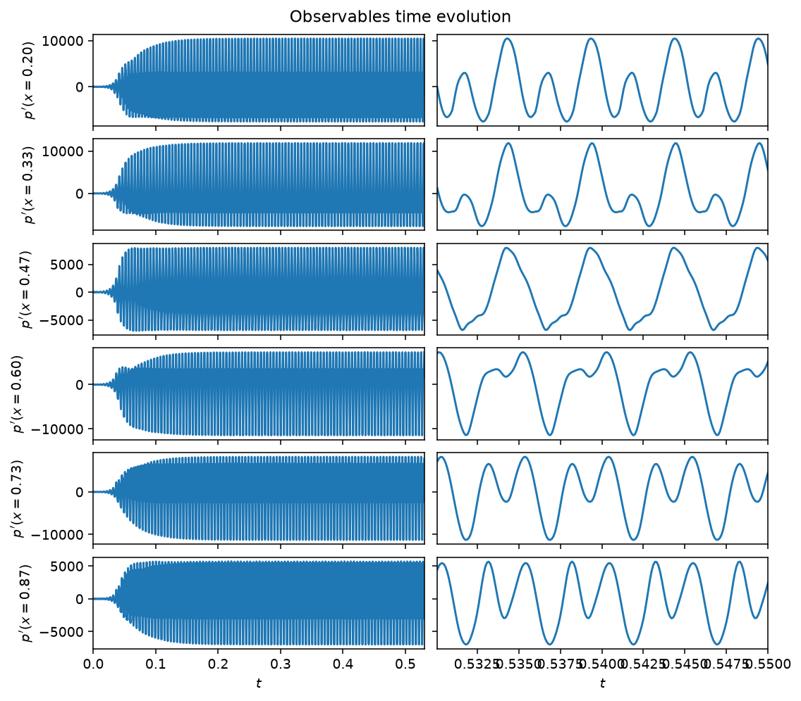

# Rijke tube

The Rijke tube is a longitudinal thermoacoustic system: a heated gauze inside
a tube couples an unsteady heat release to the acoustic field, and the two
can lock into a self-sustained oscillation. The acoustic velocity and
pressure are expanded on $N_m$ Galerkin modes, giving modal ODEs for each
mode's amplitude $\eta_j$ and its rate $\mu_j$, damped at rate
$\zeta_j = C_1 j^2 + C_2 \sqrt{j}$ and driven by the heat release projected
onto the modes. The heat release itself follows a gain-delay law: it depends
on the acoustic velocity at the flame location $x_f$, delayed by a time
$\tau$ and related through a square-root ($\text{law}='sqrt'$) or a
saturating arctangent ($\text{law}='tan'$) nonlinearity. The delay is
realized numerically by advecting the velocity along an auxiliary field
discretized with $N_c$ Chebyshev collocation points. The estimable
parameters are the heat-release intensity $\beta$, the delay $\tau$, the
damping coefficients $C_1$, $C_2$, and the saturation $\kappa$; the
observables are the pressure at `Nq` microphone locations. The full modal
equations are in the [API reference](#api) below.



*Pressure at the six default microphone locations, $\beta=4$, past the
transient. Left: the full run. Right: a few periods of the established
thermoacoustic oscillation.*

## Quickstart

```python
from dynamodels.physical import Rijke

model = Rijke(beta=4., dt=1e-4)
psi, t = model.time_integrate(Nt=5000)
model.update_history(psi, t)
model.visualize_observable_hist()
model.close()
```

## Reference

Novoa, A., & Magri, L. (2022). Real-time thermoacoustic data assimilation.
*Journal of Fluid Mechanics*, 948, A35.
[doi:10.1017/jfm.2022.653](https://doi.org/10.1017/jfm.2022.653)

## API

::: dynamodels.physical.rijke.Rijke
