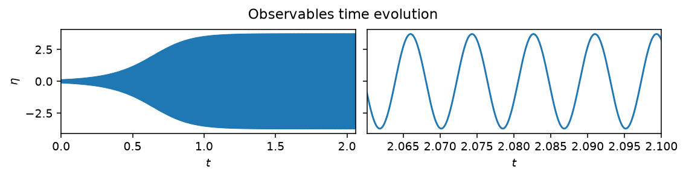
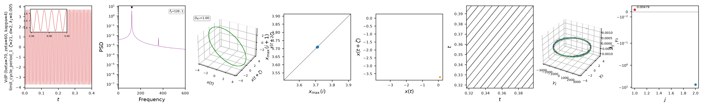

# Van der Pol

The Van der Pol oscillator is the low-order model of a single longitudinal
thermoacoustic mode: an acoustic pressure mode $\eta$ with a linear growth
rate competing against damping and a saturating nonlinearity,

$$
\ddot{\eta} + \omega^2 \eta = \dot{\eta} \left( \beta - \zeta - \kappa\, g(\eta) \right),
$$

with either a cubic ($g=\eta^2$, `law='cubic'`) or an arctangent-saturated
($g=\eta^2/(1+\kappa\eta^2/\beta)$, `law='tan'`) heat-release law. When
$\beta > \zeta$, the origin is linearly unstable and the nonlinearity
saturates the growth onto a limit cycle: a self-sustained thermoacoustic
oscillation, the simplest instance of the instability that Rijke tubes and
annular combustors also exhibit.



*Growth of the acoustic pressure $\eta$ from a small initial perturbation onto
its limit cycle, at $\beta=70$, $\zeta=60$, $\kappa=4$. Left: the full
transient. Right: the last few periods of the established oscillation.*

## Quickstart

```python
from dynamodels.physical import VdP

model = VdP(beta=70., zeta=60., kappa=4., dt=1e-4)
psi, t = model.time_integrate(Nt=20000)
model.update_history(psi, t)
model.visualize_observable_hist()
model.close()
```

`beta`, `zeta` and `kappa` are the estimable `params`, with physical bounds
already set in `alpha_lims` for data-assimilation use.

## Nonlinear diagnostics



*Diagnostics from [`ntsa.characterize`](../analysis.md), left to right: the
observable time series with a zoomed inset; power spectral density, with a
sharp fundamental and harmonics; the 3-D delay-embedded portrait, a single
closed loop; the first-return map, a single point; a plane-crossing Poincare
section; a recurrence plot of clean diagonal stripes; a 3-D classical-MDS
embedding; and a near-zero leading Lyapunov exponent, as expected for a
limit cycle.*

## Reference

Novoa, A., & Magri, L. (2022). Real-time thermoacoustic data assimilation.
*Journal of Fluid Mechanics*, 948, A35.
[doi:10.1017/jfm.2022.653](https://doi.org/10.1017/jfm.2022.653)

## API

::: dynamodels.physical.van_der_pol.VdP
